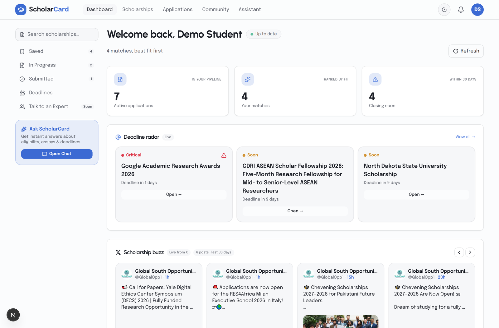
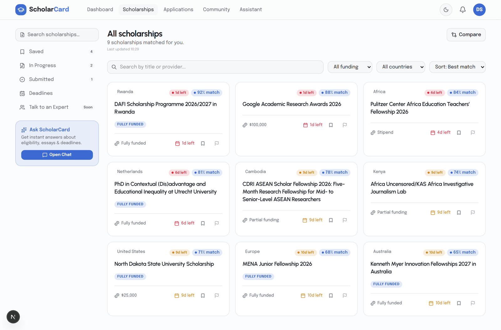
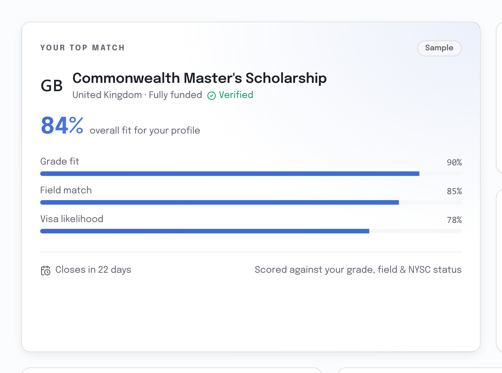
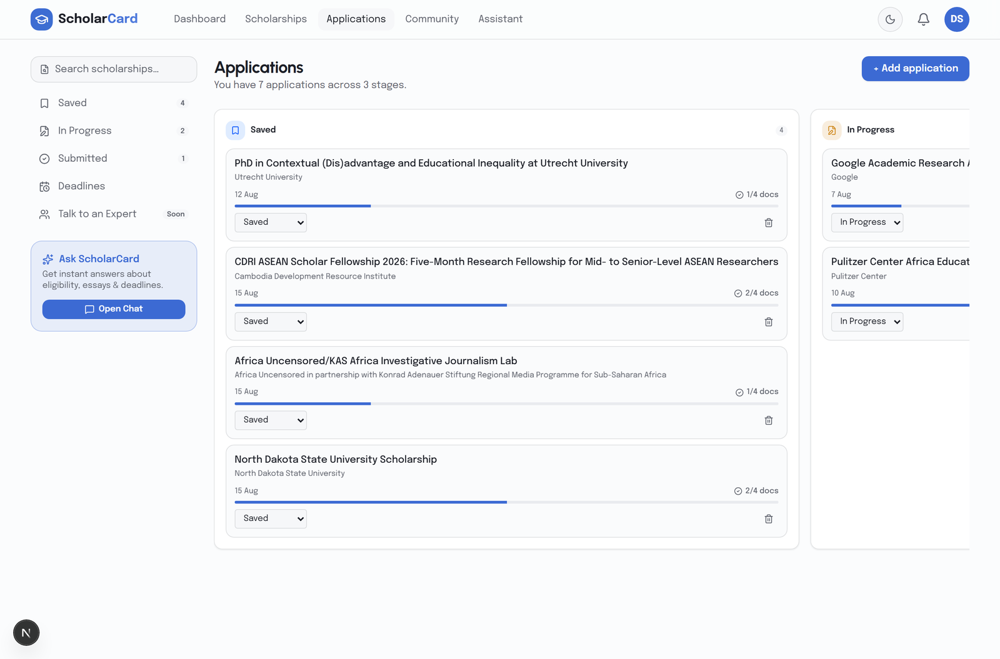
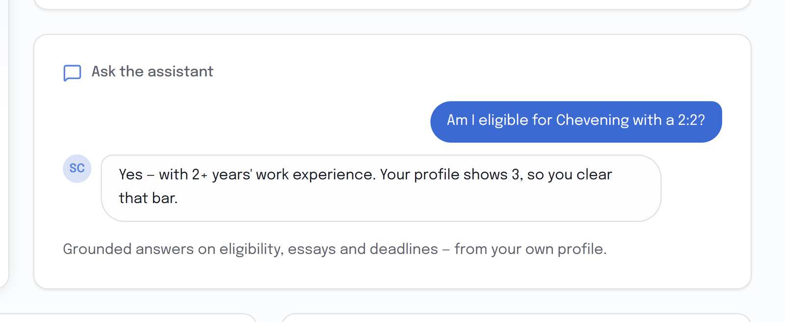

<p align="center">
  
</p>

<h1 align="center">ScholarCard</h1>

<p align="center">
  <strong>Scholarship copilot for Nigerian graduates.</strong><br>
  Tell it your degree class, field and NYSC status — it scores every scholarship against your profile, so you apply where you have a real shot, and tracks each one to its deadline.
</p>

<p align="center">
  <a href="https://scholarcard.onrender.com"><strong>Live app →</strong></a> &nbsp;·&nbsp;
  <a href="#architecture">Architecture</a> &nbsp;·&nbsp;
  <a href="#how-matching-works">How matching works</a> &nbsp;·&nbsp;
  <a href="#stack">Stack</a>
</p>

<p align="center">
  
  
  
  
  
  
  
  
  
</p>

---

## Why this exists

Nigerian graduates lose scholarships to two things: not knowing an opportunity exists, and applying to ones they were never eligible for. Generic scholarship sites list everything and rank nothing. ScholarCard does the opposite — it crawls sources continuously, filters for **Nigeria-eligible** opportunities, and scores each one against *your* profile (grade fit, field match, visa likelihood, document readiness, past Nigerian winners) so the top of your list is the one you should actually spend a weekend on.

Built and shipped solo. Live, with real users. **The source code is private** (this is a product, not a template); this repo is the public overview. Read access to the codebase is available on request for interviews and reviews: mohammed.ds.ml01@gmail.com.

## What it does

| | |
|---|---|
| **Personalised dashboard** — matches ranked by fit, deadline radar (critical / soon), active-application pipeline, and a live "scholarship buzz" feed pulled from X. |  |
| **Scored scholarship list** — every listing carries a fit score broken down by the factors that decide your odds. Nothing is shown unfiltered. |  |
| **Match-score breakdown** — grade equivalence (Nigerian classes → GPA/UK class), field alignment, visa likelihood, doc readiness. Explains *why*, not just a number. |  |
| **Application tracker** — saved → in progress → submitted, with per-scholarship deadline countdowns and referee management. |  |
| **AI assistant** — streaming chat that can search scholarships, check your eligibility and compute your score via tool calls against your real profile. |  |

Also: on-demand scan (streams progress over SSE while a Playwright crawler runs), scam badges on suspicious listings, deadline audits that flag stale dates, email/in-app alerts, Google OAuth, and a mobile layout.

## Architecture

```
                         ┌───────────────────────────────────────────┐
                         │  Next.js 16 (App Router, React 19)        │
   Browser ──────────────┤  • dashboard / scholarships / tracker     │
                         │  • /api/chat  → Vercel AI SDK agent        │
                         │  • /api/scrape → spawns Python, streams SSE│
                         └───────┬───────────────────┬───────────────┘
                                 │                   │ child process
                                 ▼                   ▼
                       ┌─────────────────┐  ┌───────────────────────────┐
                       │ Supabase        │  │ scraper-py (FastAPI)      │
                       │ Postgres + Auth │◄─┤ Playwright crawler        │
                       │ + Storage, RLS  │  │ LLM extraction + dateparser│
                       └─────────────────┘  └───────────────────────────┘
                                 ▲
                                 │ 6-hourly
                       ┌─────────┴─────────┐
                       │ GitHub Actions    │  full crawl → deadline audit → alerts
                       └───────────────────┘
```

**One Docker image, three runtimes.** The Node server and the Python/Playwright scraper ship in the same container; the web app spawns the scraper as a child process for on-demand scans and streams its progress events back to the browser. The *scheduled* crawl does not run in that container — a free Render instance has neither the RAM for Chromium nor a reliable timer — so it runs in GitHub Actions and writes to the same Supabase tables. The scheduled crawl, deadline audit and alert generation run as a GitHub Actions workflow writing to the same Supabase tables.

### Design decisions

| Decision | Why |
|---|---|
| **LLM fallback chain, not one provider** (`src/lib/agents/model.ts`) | Free tiers rate-limit per model. The chat model is a `Proxy` that retries `doStream`/`doGenerate` on the next leg (Groq primary → Groq fallback → OpenRouter) *only* for 429/5xx-class errors. 401/402/404 are terminal and surface immediately — a lesson from a bug where an out-of-credits 402 was retried into an empty chat bubble. |
| **Agent tools query the DB, not a prompt dump** | `searchScholarships`, `checkEligibility`, `calculateScore` hit Supabase with the user's profile. The model reasons; the data stays authoritative. |
| **AI extraction + regex fallback + `dateparser`** | Scholarship pages are inconsistent. Extraction is LLM-driven with Zod-validated output, but deadlines get a second pass through regex + `dateparser`, and each record carries `deadline_type` (`fixed / rolling / estimated / unknown`) so the UI never fakes certainty. |
| **Deadline & link audits as separate jobs** | Listings rot. Scheduled audits re-verify deadlines and apply-URLs and flag stale ones rather than silently serving them. |
| **Row-level security everywhere** | Profiles, applications, documents and referees are RLS-scoped per user in Postgres. The service role is used only by the crawler. |
| **Python for scraping, TypeScript for everything else** | Playwright + `httpx` + `feedparser` + `dateparser` made the crawler far more robust than the original Crawlee/TS version, which is kept for reference under `src/scraper/`. |

## How matching works

1. **Profile** — degree class, field, graduation year, NYSC status, state of origin, documents on hand.
2. **Eligibility gate** — hard filters (nationality, degree level, field, deadline not passed).
3. **Fit score** — weighted factors: grade fit (with Nigerian → international grade equivalence), field match, visa likelihood for the host country, document readiness, and prior Nigerian winners where known.
4. **Urgency** — closing-soon boosts and a deadline radar so the top of the list is both winnable *and* actionable.

Scoring lives in `src/lib/scorer.ts` and `src/lib/agents/eligibility.ts`; `npm run eval:personalisation` replays a set of profiles against the live catalogue to catch regressions.

## Stack

**Frontend** Next.js 16 · React 19 · TypeScript · Tailwind v4 · `@base-ui/react`
**AI** Vercel AI SDK · Groq · OpenRouter · Gemini (extraction) · Zod-validated tool calls
**Data** Supabase (Postgres, Auth, Storage, RLS)
**Scraper** Python 3.12 · Playwright · FastAPI (SSE) · httpx · feedparser · dateparser · Pydantic
**Ops** Docker · Render (web) · GitHub Actions (crawl + audits) · Resend (alerts)

## Status & limitations

- Live and in use, actively developed. Source catalogue is curated + crawled; coverage skews to postgraduate opportunities.
- Free-tier hosting means the first request after idle can take ~1 min (Render spin-up). Details and the keep-alive approach are in `DEPLOY.md`.
- Search-engine-based discovery is blocked from Render's IPs (DuckDuckGo), so discovery runs only in the GitHub Actions crawl.

